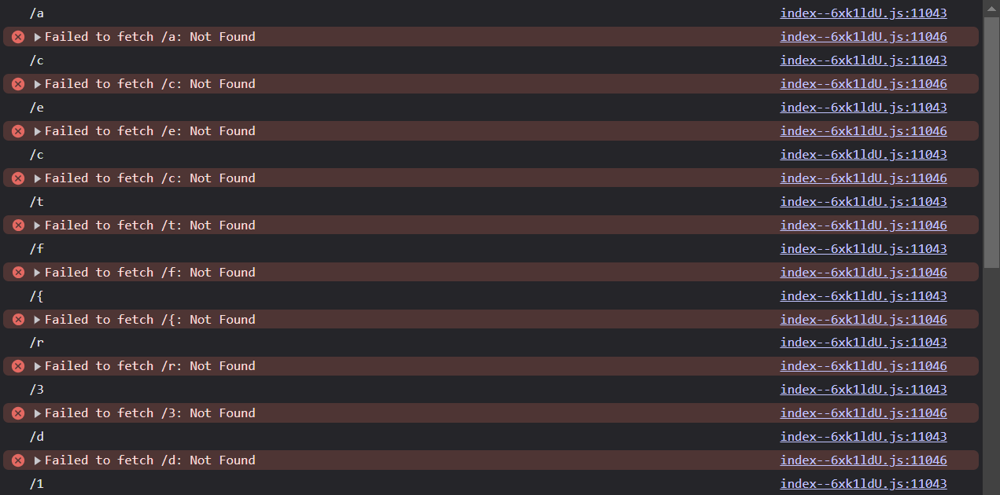
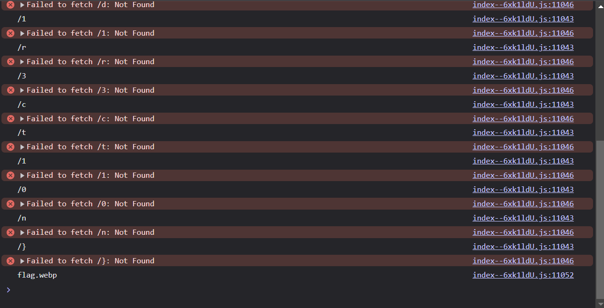

## Flag Fetcher

---

### Challenge

Hey guys, I created a flag fetcher using some web stacks & technologies. It was supposed to fetch the flag.webp image file which contains the flag but there was some kind of error in doing that. Can you verify it? Maybe just get the flag I don't really care if you fix it or not.

[This should've worked](http://34.131.133.224/Flag-Fetcher/)

---

### Solution

Frankly, I'm not sure whether the chall was supposed to be this easy. But when I inspected the website, especially the console, I found this string of errors.




If you closesly observe this, you can see that the strings represent `acectf{r3d1r3ct10n}`

I converted this to proper flag format and got the correct flag.

---

### Flag

```
ACECTF{r3d1r3ct10n}
